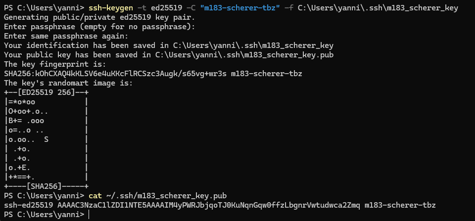
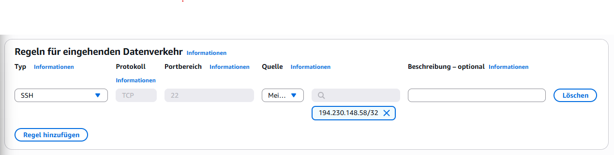
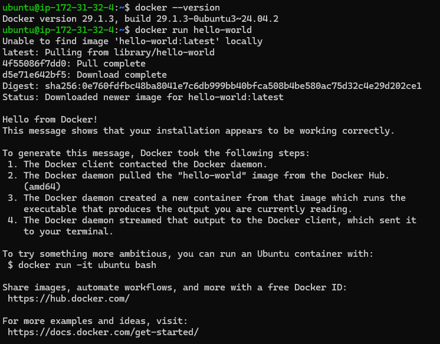

# EC2-Setup: Grundlage für alle Kompetenznachweise

**Modul:** M183 – Applikationssicherheit implementieren  
**Auftrag:** EC2-Setup  
**Benutzer:** yanni (scherer)  
**Datum:** Juni 2026

---

## Inhaltsverzeichnis

1. [A) AWS Learner Lab starten](#a-aws-learner-lab-starten)
2. [B) SSH-Schlüsselpaar lokal generieren](#b-ssh-schlüsselpaar-lokal-generieren)
3. [C) Sicherheitsgruppe erstellen](#c-sicherheitsgruppe-erstellen)
4. [D) EC2-Instanz mit Cloud-Init-Script starten](#d-ec2-instanz-mit-cloud-init-script-starten)
5. [E) SSH-Verbindung herstellen und Docker prüfen](#e-ssh-verbindung-herstellen-und-docker-prüfen)
6. [Leitfragen / Checkpoints](#leitfragen--checkpoints)

---

## A) AWS Learner Lab starten

Das AWS Learner Lab wurde über `awsacademy.instructure.com` mit dem Schulkonto geöffnet. Nach dem Klick auf **Start Lab** wurde gewartet, bis der Punkt neben «AWS» grün wurde, und anschliessend die AWS Management Console geöffnet.

> Keine Abgabe für diesen Schritt erforderlich.

---

## B) SSH-Schlüsselpaar lokal generieren

Das SSH-Schlüsselpaar wurde lokal auf dem eigenen Rechner (Windows, PowerShell) generiert. Der Public Key wird ins Cloud-Init-Script eingetragen; der Private Key bleibt ausschliesslich lokal.

**Verwendeter Befehl:**

```powershell
ssh-keygen -t ed25519 -C "m183-scherer-tbz" -f C:\Users\yanni\.ssh\m183_scherer_key
```

**Screenshot – SSH-Schlüsselpaar generieren und Public Key auslesen:**



Das Terminal zeigt den vollständigen Ablauf:

**Schlüsselpaar-Generierung:**
```
Generating public/private ed25519 key pair.
Enter passphrase (empty for no passphrase):
Enter same passphrase again:
Your identification has been saved in C:\Users\yanni\.ssh\m183_scherer_key
Your public key has been saved in C:\Users\yanni\.ssh\m183_scherer_key.pub
The key fingerprint is:
SHA256:kOhCXAQ4kKLSV6e4uKKcFlRCSzc3Augk/s65vg+wr3s m183-scherer-tbz
```

Das Randomart-Bild bestätigt die erfolgreiche Erstellung des ed25519-Schlüsselpaars.

**Public Key auslesen:**
```powershell
PS C:\Users\yanni> cat ~/.ssh/m183_scherer_key.pub
ssh-ed25519 AAAAC3NzaC1lZDI1NTE5AAAAIM4yPWRJbjqoTJ0KuNqnGqw0ffzLbgnrVwtudwca2Zmq m183-scherer-tbz
```

Der Public Key ist eine einzelne Zeile mit dem Format `ssh-ed25519 <key> <kommentar>`. Diese Zeile wurde vollständig kopiert und im nächsten Schritt ins Cloud-Init-Script eingetragen.

> **Wichtig:** Der Private Key (`m183_scherer_key`) bleibt immer lokal und wird niemals weitergegeben. Nur der Public Key (`.pub`) wird auf dem Server hinterlegt.

---

## C) Sicherheitsgruppe erstellen

In der AWS Management Console wurde unter **EC2 → Network & Security → Security Groups** eine neue Sicherheitsgruppe angelegt:

- **Name:** `m183-sg`
- **Beschreibung:** M183 KN Sicherheitsgruppe
- **VPC:** Standard-VPC

**Screenshot – Inbound Rule für SSH (Port 22):**



Die Inbound Rule zeigt:

| Typ | Protokoll | Portbereich | Quelle |
|-----|-----------|-------------|--------|
| SSH | TCP | 22 | `194.230.148.58/32` |

Die Quelle ist auf die eigene IP-Adresse (`194.230.148.58/32`) beschränkt – **nicht** `0.0.0.0/0`. Das `/32` bedeutet, dass nur exakt diese eine IP-Adresse SSH-Zugriff erhält, was dem **Least-Privilege-Prinzip** entspricht.

> ⚠️ `0.0.0.0/0` als SSH-Quelle würde den Zugang für das gesamte Internet öffnen – das ist ein kritisches Sicherheitsrisiko und wird im Auftrag explizit verboten.

---

## D) EC2-Instanz mit Cloud-Init-Script starten

### Schritt 1 – Cloud-Init-Script

Das Cloud-Init-Script wird beim ersten Start der EC2-Instanz automatisch ausgeführt. Es richtet den Ubuntu-Benutzer ein, fügt den SSH-Schlüssel hinzu und installiert Docker.

**cloud-init.txt:**

```yaml
#cloud-config

users:
  - name: ubuntu
    groups: docker
    sudo: ALL=(ALL) NOPASSWD:ALL
    shell: /bin/bash
    ssh_authorized_keys:
      - ssh-ed25519 AAAAC3NzaC1lZDI1NTE5AAAAIM4yPWRJbjqoTJ0KuNqnGqw0ffzLbgnrVwtudwca2Zmq m183-scherer-tbz

packages:
  - docker.io

runcmd:
  - systemctl start docker
  - systemctl enable docker
```

Das Script tut Folgendes:

- **`users`:** Erstellt den Benutzer `ubuntu`, fügt ihn zur `docker`-Gruppe hinzu, erlaubt sudo ohne Passwort und trägt den Public Key aus Schritt B in `authorized_keys` ein.
- **`packages`:** Installiert `docker.io` automatisch beim ersten Boot.
- **`runcmd`:** Startet den Docker-Dienst und aktiviert ihn für den Autostart.

### Schritt 2 – Instanz starten

Die Instanz wurde mit folgenden Einstellungen gestartet:

| Einstellung | Wert |
|-------------|------|
| Name | `m183-kn0` |
| AMI | Ubuntu Server 24.04 LTS (64-bit x86) |
| Instance type | `t3.micro` |
| Key pair | Proceed without a key pair (SSH via eigenem Schlüssel) |
| Security group | `m183-sg` |
| Storage | 12 GB gp3 |

Das Cloud-Init-Script wurde in das Feld **User data** unter Advanced details eingefügt. Nach dem Start wurde gewartet, bis der Instance State auf **Running** wechselte, und die Public IPv4 Address notiert.

---

## E) SSH-Verbindung herstellen und Docker prüfen

Nach ca. 2 Minuten (Wartezeit für Cloud-Init) wurde die SSH-Verbindung hergestellt:

```powershell
ssh -i ~\.ssh\m183_scherer_key ubuntu@<PUBLIC-IP>
```

**Screenshot – SSH-Terminal mit Docker-Verifikation:**



Das Terminal zeigt zwei Befehle und ihre Ausgaben:

**1. Docker-Version prüfen:**
```
ubuntu@ip-172-31-32-4:~$ docker --version
Docker version 29.1.3, build 29.1.3-0ubuntu3~24.04.2
```

Docker wurde erfolgreich durch das Cloud-Init-Script installiert. Version 29.1.3 läuft auf Ubuntu 24.04.

**2. Docker Hello-World Container starten:**
```
ubuntu@ip-172-31-32-4:~$ docker run hello-world
Unable to find image 'hello-world:latest' locally
latest: Pulling from library/hello-world
4f55086f7dd0: Pull complete
d5e71e642bf5: Download complete
Digest: sha256:0e760fdfbc48ba8041e7c6db999bb40bfca508b4be580ac75d32c4e29d202ce1
Status: Downloaded newer image for hello-world:latest

Hello from Docker!
This message shows that your installation appears to be working correctly.
```

Die Bestätigungszeile **«Hello from Docker! This message shows that your installation appears to be working correctly.»** beweist, dass Docker korrekt installiert ist und Container starten kann.

Der Prompt `ubuntu@ip-172-31-32-4` zeigt:
- Benutzername: `ubuntu` (korrekt – nicht `ec2-user`)
- Hostname: `ip-172-31-32-4` (private IP der EC2-Instanz)

---

## Leitfragen / Checkpoints

**1. Public Key vs. Private Key – Unterschied:**

Der **Private Key** ist der geheime Teil des Schlüsselpaars – er bleibt ausschliesslich auf dem eigenen Rechner und darf niemals weitergegeben werden. Der **Public Key** ist der öffentliche Teil – er kann bedenkenlos auf Servern hinterlegt werden (z.B. in `authorized_keys`). Bei einer SSH-Verbindung beweist der Client, dass er den Private Key besitzt, ohne ihn je zu übertragen – mathematisch über asymmetrische Kryptographie.

**2. Warum darf der Private Key nicht weitergegeben werden?**

Wer den Private Key kennt, kann sich als der Eigentümer auf allen Servern authentifizieren, die den zugehörigen Public Key hinterlegt haben – ohne Passwort. Ein gestohlener Private Key bedeutet vollständigen Zugriffsverlust auf alle damit gesicherten Systeme.

**3. Was ist ein Cloud-Init-Script und wann wird es ausgeführt?**

Cloud-Init ist ein Standardmechanismus für die Erstkonfiguration von Cloud-Instanzen. Das Script wird **einmalig beim allerersten Start** der Instanz automatisch ausgeführt – noch bevor sich ein Benutzer einloggen kann. Es eignet sich für die Installation von Software, Benutzereinrichtung und Dienst-Konfiguration, ohne dass manuelle Eingriffe nötig sind.

**4. Warum ist `0.0.0.0/0` als SSH-Source ein Sicherheitsrisiko?**

`0.0.0.0/0` bedeutet «alle IP-Adressen der Welt». Jeder im Internet könnte versuchen, sich per SSH zu verbinden. Automatisierte Bots scannen ständig das Internet nach offenen SSH-Ports und versuchen Brute-Force-Angriffe. Mit `My IP` (z.B. `194.230.148.58/32`) wird der Zugang auf genau eine IP beschränkt – das **Least-Privilege-Prinzip**.

**5. EC2-Instanz starten, stoppen und terminieren:**

- **Start:** EC2 → Instances → Instance state → Start instance
- **Stop:** Instanz wird angehalten, Daten bleiben erhalten, keine Compute-Kosten. Bei erneutem Start ändert sich die Public IP.
- **Terminate:** Instanz und alle Daten werden dauerhaft und unwiderruflich gelöscht.

**6. Unterschied Stop vs. Terminate:**

| | Stop | Terminate |
|--|------|-----------|
| Daten | Erhalten | Gelöscht |
| EBS-Volume | Bleibt | Wird gelöscht |
| Public IP | Ändert sich beim Neustart | Entfällt |
| Kosten | Nur Storage | Keine |
| Umkehrbar | Ja | Nein |

**7. SSH-Verbindung mit eigenem Schlüssel:**

```powershell
ssh -i ~\.ssh\m183_scherer_key ubuntu@<PUBLIC-IP>
```

Der `-i`-Parameter gibt den Pfad zum Private Key an. Beim ersten Verbinden erscheint eine Fingerprint-Warnung – diese wird mit `yes` bestätigt und der Host wird dauerhaft in `known_hosts` gespeichert.

**8. Docker-Installation verifizieren:**

```bash
docker --version      # Zeigt installierte Version
docker run hello-world  # Startet Test-Container, bestätigt vollständige Funktionalität
```

Die Ausgabe «Hello from Docker!» beweist, dass der Docker-Daemon läuft, der Client kommunizieren kann und Images von Docker Hub heruntergeladen werden können.

---

## Screenshot-Übersicht

| Dateiname | Inhalt |
|-----------|--------|
| `ssh-key.png` | B – PowerShell: `ssh-keygen`-Befehl + Randomart-Bild + Public Key Ausgabe mit `cat` |
| `inbound.png` | C – AWS Console: Inbound Rule SSH Port 22, Quelle `194.230.148.58/32` (My IP) |
| `cloud-init.txt` | D – Cloud-Init-Script mit eingetragenem Public Key (`m183-scherer-tbz`) |
| `docker.png` | E – SSH-Terminal `ubuntu@ip-172-31-32-4`: `docker --version` (29.1.3) + `docker run hello-world` |

---