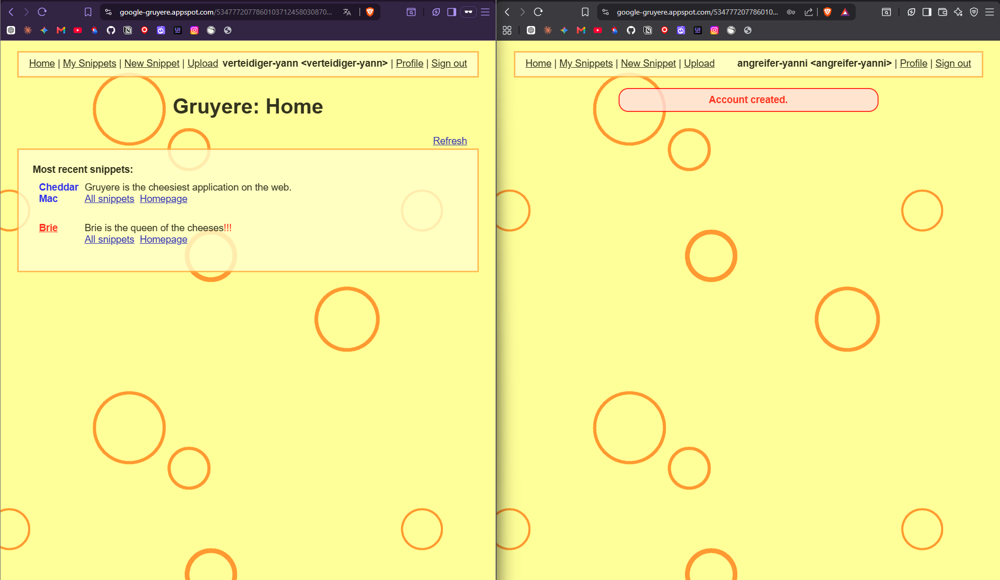
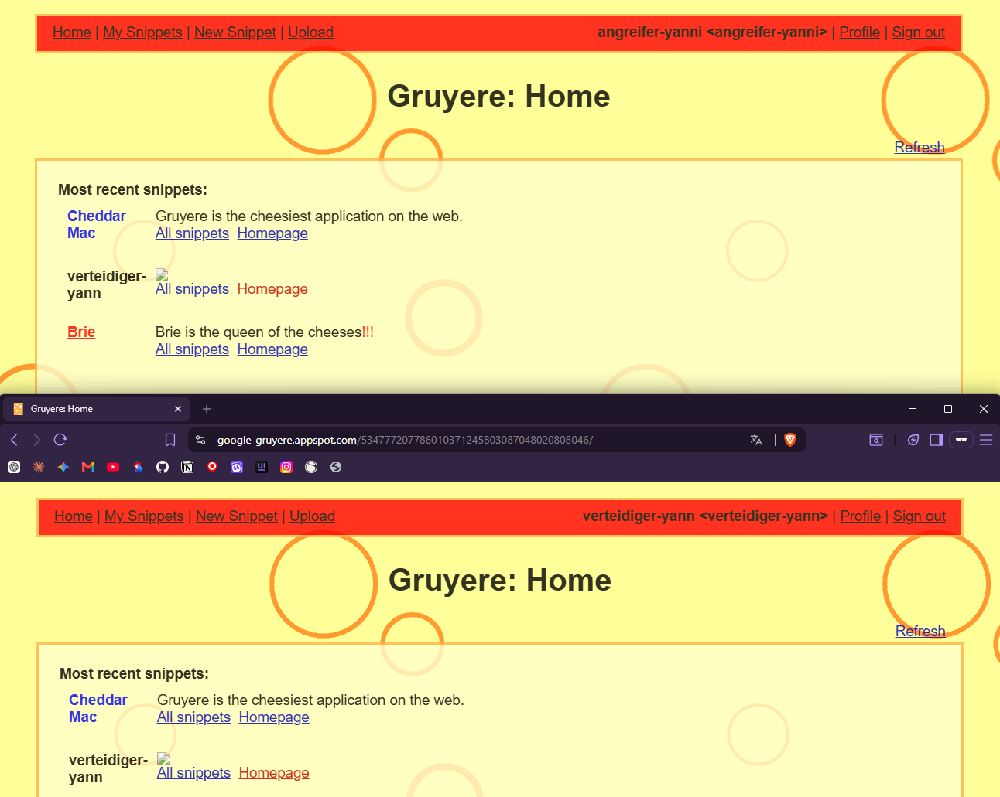
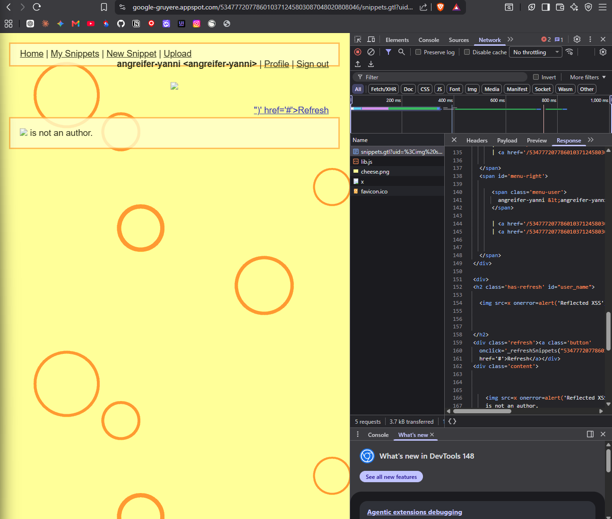
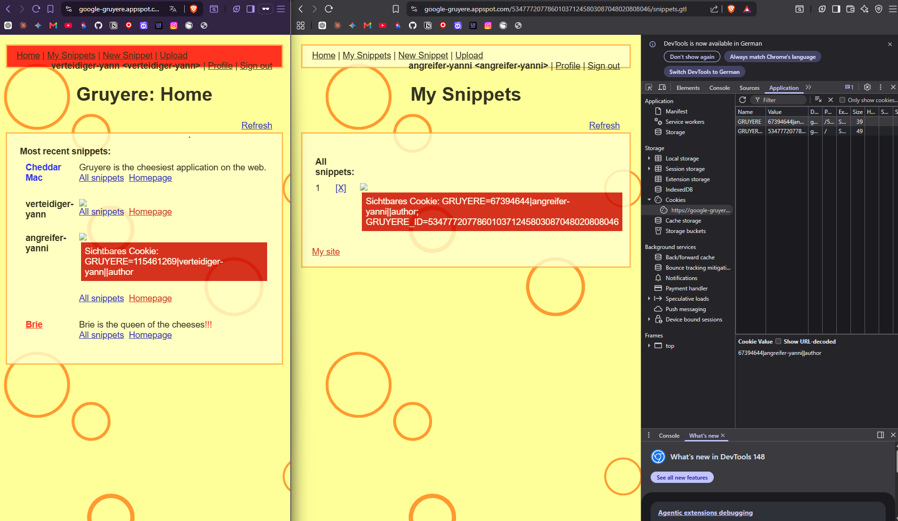
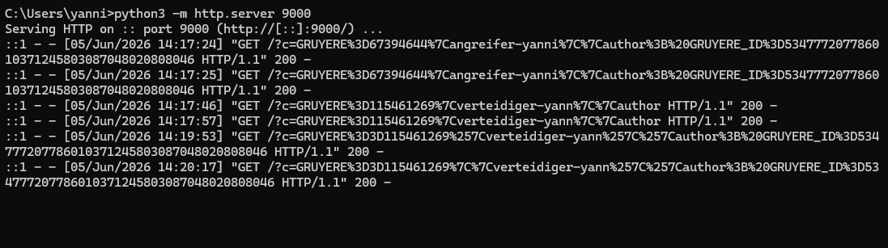
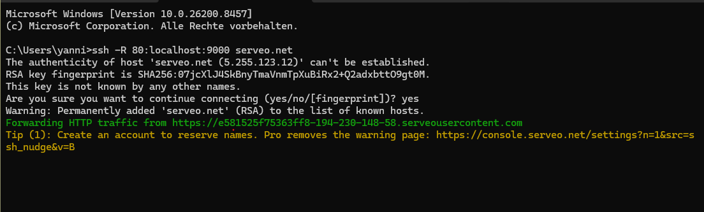
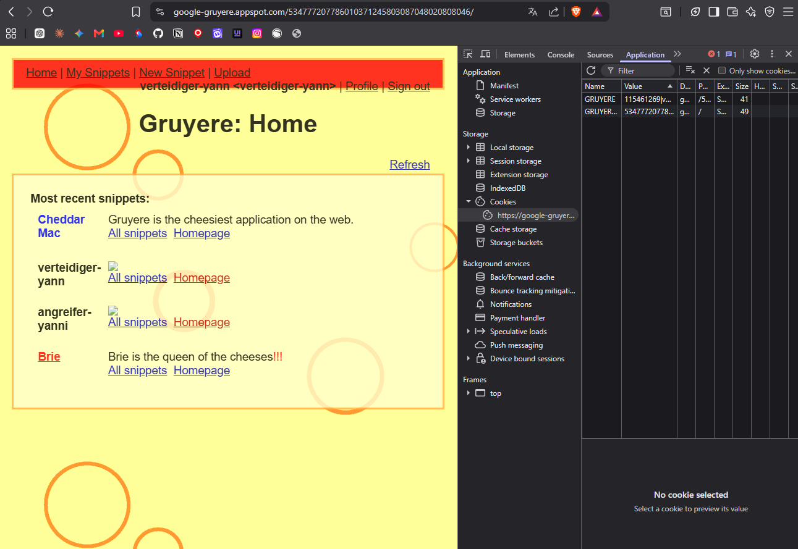
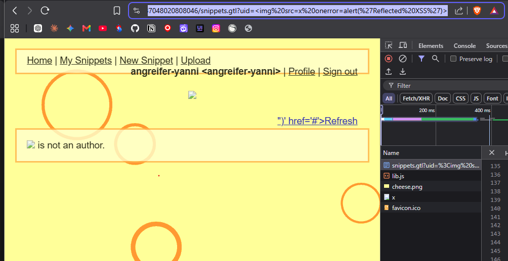
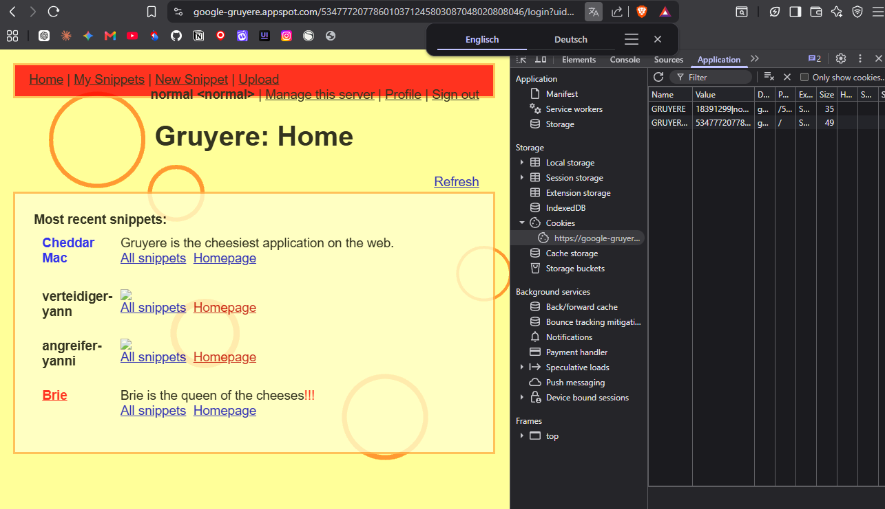

# KN01: OWASP Top 10 – Gruyere
## Schriftliche Antworten – Scherer Yanni

---

## A) Gruyere starten & Accounts erstellen

*Gruyere-Startseite mit sichtbarer UID in der URL.*

*Bestätigungsseite beider Accounts (angreifer-yanni & verteidiger-yann).*

---

## B1 – Stored XSS: DOM-Manipulation

*Das Menü wurde durch den ``-Payload rot gefärbt – im Browser des Angreifers.*

*Derselbe Effekt im Browser des Verteidigers – der gespeicherte Payload trifft alle Besucher.*

**1. Warum konnte der Payload die Sicherheitsprüfung des Browsers umgehen, obwohl `<script>` blockiert wird?**

`<script>`-Tags werden von modernen Browsern (z.B. Brave) in Formularfeldern erkannt und blockiert. Der Payload `` umgeht diese Prüfung, weil er kein `<script>`-Tag verwendet, sondern einen HTML-Event-Handler (`onerror`). Dieser wird ausgelöst, sobald das Bild nicht geladen werden kann – was bei `src="x"` immer der Fall ist.

**2. Was bedeutet es für die Sicherheit, dass der Payload auch im Browser des Verteidigers ausgeführt wird?**

Das zeigt das Kernproblem von Stored XSS: Der Schadcode wird einmal gespeichert und trifft danach jeden Benutzer, der die Seite aufruft – ohne dass dieser etwas Falsches getan hat. Ein Angreifer muss das Opfer nicht gezielt angreifen.

**3. Welche OWASP Top 10 Kategorie (2025) beschreibt Stored XSS?**

**A03:2021 – Injection**
XSS ist eine Form von Injection, bei der schädlicher Code in eine Webseite injiziert und im Browser des Opfers ausgeführt wird.

**4. Was hätte die Applikation tun müssen, damit dieser Payload harmlos bleibt?**

Die Applikation hätte **Output Encoding** anwenden müssen. Alle Sonderzeichen wie `<`, `>` und `"` werden vor der Ausgabe in ihre HTML-Entities umgewandelt (`&lt;`, `&gt;`, `&quot;`). Dadurch wird `` als reiner Text angezeigt und nicht als HTML-Code interpretiert.

---

## B2 – Cookies und Session-Hijacking

**1. Was kann ein Angreifer tun, wenn er den Session-Cookie eines anderen Benutzers kennt?**

Der Angreifer kann den gestohlenen Cookie in seinem eigenen Browser einsetzen und sich damit als das Opfer ausgeben – ohne dessen Passwort zu kennen. Der Server kann nicht unterscheiden, ob die Anfrage vom echten Benutzer oder vom Angreifer kommt, da er nur den Cookie zur Authentifizierung prüft. Dies wird als **Session-Hijacking** bezeichnet.

**2. Was bewirkt das `HttpOnly`-Flag bei einem Cookie und wie schützt es vor diesem Angriff?**

Das `HttpOnly`-Flag verhindert, dass JavaScript über `document.cookie` auf den Cookie zugreifen kann. Damit kann ein XSS-Payload den Session-Cookie nicht mehr auslesen und an einen Angreifer-Server senden.

**3. Warum ist es gefährlich, Session-Cookies im `localStorage` statt in einem `HttpOnly`-Cookie zu speichern?**

`localStorage` ist über JavaScript vollständig zugänglich. Ein XSS-Angriff kann damit den Session-Token direkt auslesen und exfiltrieren. Ein `HttpOnly`-Cookie hingegen ist für JavaScript unsichtbar, was diesen Angriff verhindert.

---

## B3 – Session-Hijacking: Cookie-Exfiltration

*SSH-Terminal 1: Der Python-HTTP-Server zeigt die eingehende GET-Anfrage mit dem Cookie des Verteidigers.*

*SSH-Terminal 2: Der Serveo-Tunnel stellt eine öffentliche HTTPS-URL für den Angreifer-Server bereit.*

*Nach der Cookie-Übernahme ist der Angreifer als verteidiger-yann eingeloggt.*

**1. Warum konnte der Angreifer den Cookie des Verteidigers erhalten, ohne je dessen Passwort zu kennen?**

Der Payload wurde als Stored XSS in der Datenbank gespeichert. Sobald der Verteidiger die Seite aufrief, führte sein eigener Browser den Schadcode aus. Der Code sendete den Cookie automatisch per GET-Anfrage an den Angreifer-Server. Das Passwort war nie notwendig – der Cookie reicht zur Authentifizierung aus.

**2. Welche Rolle spielt der `new Image().src`-Trick trotz Same-Origin-Policy?**

Die Same-Origin-Policy verhindert, dass JavaScript Antworten von anderen Domains *liest*. Sie verhindert jedoch nicht, dass der Browser Ressourcen von anderen Domains *anfordert*. `new Image().src = '...'` löst eine GET-Anfrage aus, ohne die Antwort zu lesen. Der Cookie wird als URL-Parameter mitgeschickt und im Server-Log sichtbar.

**3. Warum war der Serveo-Tunnel notwendig?**

Gruyere läuft auf HTTPS. Moderne Browser blockieren **Mixed Content**: Eine HTTPS-Seite darf keine HTTP-Anfragen ins offene Internet schicken. Ohne den Tunnel wäre die Anfrage an `http://EC2-IP:9000` blockiert worden. Serveo stellt eine öffentliche HTTPS-URL bereit, die der Browser akzeptiert.

**4. Zwei technische Massnahmen gegen diesen Angriff:**

- **Output Encoding**: Verhindert, dass der Payload überhaupt in die Seite injiziert wird.
- **HttpOnly-Flag auf Session-Cookies**: JavaScript kann den Cookie nicht mehr auslesen, auch wenn XSS erfolgreich ist.
- **Content Security Policy (CSP)**: Verhindert, dass der Browser Anfragen an unbekannte externe Domains sendet.

**5. Was bewirkt das `Secure`-Flag bei einem Cookie?**

Das `Secure`-Flag sorgt dafür, dass der Cookie nur über verschlüsselte HTTPS-Verbindungen übertragen wird. Es schützt vor Man-in-the-Middle-Angriffen in unverschlüsselten Netzwerken (z.B. öffentliches WLAN). Gegen XSS schützt es hingegen nicht.

---

## C – Reflected XSS

*Die Alert-Box wurde durch den Reflected-XSS-Payload ausgelöst. Der Payload ist in der URL sichtbar.*

**1. Hauptunterschied zwischen Stored XSS und Reflected XSS:**

| | Stored XSS | Reflected XSS |
|---|---|---|
| **Persistenz** | Payload in der Datenbank gespeichert | Payload nicht gespeichert |
| **Reichweite** | Trifft jeden Besucher der Seite | Trifft nur wer den manipulierten Link öffnet |
| **Gefahr** | Höher – automatisch, passiv | Geringer – Opfer muss Link aktiv öffnen |

**2. Wie würde ein Angreifer das Opfer dazu bringen, den Link zu öffnen?**

Der Angreifer würde **Social Engineering** einsetzen: Den Link in einer Phishing-E-Mail verschicken, auf Social Media posten, oder mit einem URL-Shortener (z.B. bit.ly) verkürzen damit der Payload nicht sichtbar ist.

**3. Welcher OWASP Proactive Control schützt gegen XSS?**

**C4: Encode and Escape Data** – Alle Ausgaben müssen kontextabhängig enkodiert werden (HTML, JavaScript, URL). Injizierte Zeichen wie `<` und `>` werden als harmloser Text behandelt und nicht als ausführbarer Code.

---

## D – Client-State Manipulation

*DevTools zeigen den Cookie-Inhalt mit der Rolle `normal`.*

*Nach dem Aufruf der saveprofile-URL erscheint der "Manage this server"-Link – Admin-Rechte wurden erlangt.*

**1. Warum ist es gefährlich, sicherheitsrelevante Daten im Client zu speichern?**

Alles was im Browser liegt, kann vom Benutzer eingesehen und verändert werden. Cookies können in den DevTools direkt bearbeitet werden. Wenn die Applikation diesen Werten vertraut, kann jeder Benutzer seine eigenen Berechtigungen beliebig erhöhen – ohne auf dem Server authentifiziert zu sein.

**2. Wo sollten Berechtigungsprüfungen stattfinden?**

Berechtigungsprüfungen müssen **immer auf dem Server** stattfinden. Der Client liegt ausserhalb der Kontrolle der Applikation und kann manipuliert werden. Client-seitige Prüfungen (z.B. versteckte UI-Elemente) sind nur zur Verbesserung der Benutzererfahrung gedacht – niemals als Sicherheitsmassnahme.

**3. Welche OWASP Top 10 Kategorie beschreibt dieses Problem?**

**A01:2021 – Broken Access Control** – Die Applikation schränkt den Zugriff auf Funktionen nicht korrekt ein. Ein normaler Benutzer kann durch Manipulation von Client-Daten Admin-Rechte erlangen, weil die Autorisierung nicht serverseitig geprüft wird.
